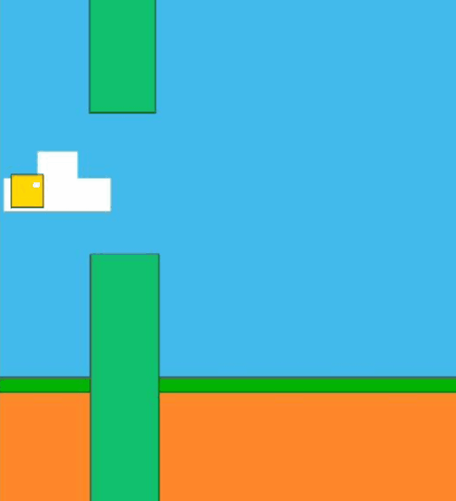

# Flying Cube
**Flying Cube** terdiri dari beberapa objek element `div` dan `span`. Beberapa element memakai `pseudo-element`, seperti elemen dengan class *`.block`* .
Logika kekalahan diatur dalam beberapa **variabel**.

##### [Flying Cube]()
